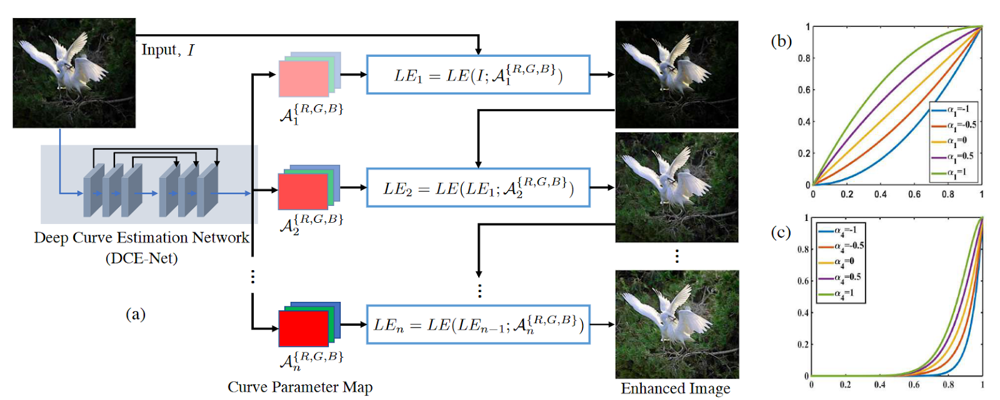
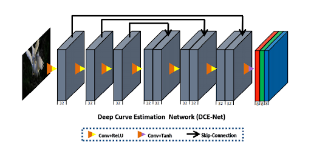
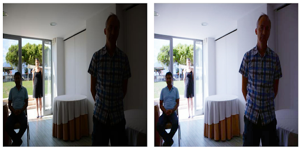
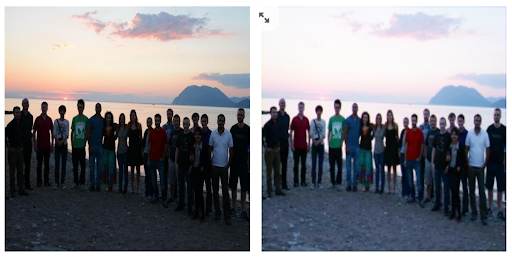
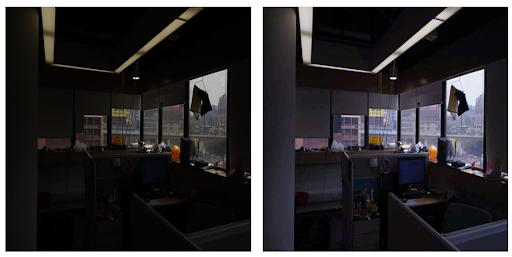
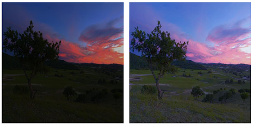

# Zero-Reference Deep Curve Estimation (ZeroDCE) for Low-Light Image Enhancement
PyTorch implementation of [Zero-Reference Deep Curve Estimation for Low-Light Image Enhancement](https://arxiv.org/pdf/2001.06826.pdf) Chongyi Li et al.

## Main Model Architecture
Complete model which will iteratively apply pixel-wise transformations to an image to enhance it.

## CNN Architecture

## Loss Functions
* Spatial Loss
* Exposure Control Loss
* Color Loss
* Illumination Smoothness Loss

## Prerequisites
* Pytorch
* NumPy
* python 3

## Some Results

## Contributors:

- [Ankur Chemburkar](https://github.com/Developer-Zer0)
- [Devang Jain](https://github.com/djrobin17)
- [Hashir K](https://github.com/hashirkk07)
